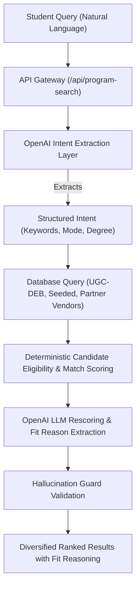
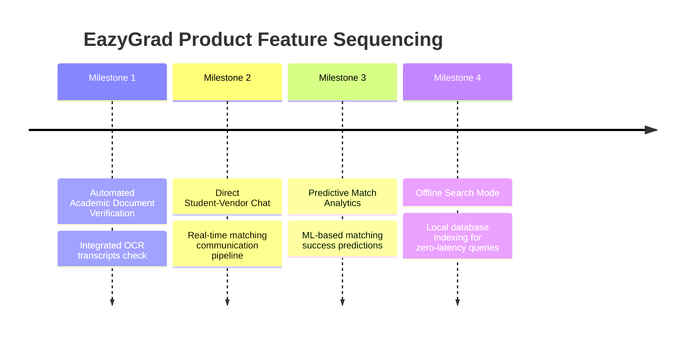

# EazyGrad AI Programme Search & Recommendation Architecture

Welcome to the architectural design documentation for EazyGrad. This document explains the technical implementation, security guardrails, data engineering pipeline, and product roadmap for the student-facing AI search and recommendation engine.

---

## 1. Core Workflow & AI Matching Pipeline

EazyGrad connects natural language query intents with verified, institutional higher-education data. The engine operates in a multi-stage pipeline designed for speed, relevance, and precise reasoning.



### Stage 1: Natural Language Intent Extraction
- **API Endpoint**: `/api/program-search`
- **Method**: The student input is processed by a fast, JSON-instructed LLM layer (`gpt-4o-mini`). It extracts query properties without accessing the DB directly:
  - `keywords`: Database-friendly search terms.
  - `degree_type`: Course level (UG, PG, Diploma).
  - `mode`: Delivery preference (Online, Distance, Regular).
- **Fail-Safe Fallback**: If the OpenAI service is down or unconfigured, the system immediately switches to a **deterministic NLP regex-based keyword parser** to extract subject categories and preferences.

### Stage 2: Database Query & Base Selection
- Results are pulled via combined Django `Q` object filters against:
  - **Seeded Programmes**: 20 mock/demo courses (law, management, arts).
  - **UGC-DEB Bureau Records**: Fully integrated distance and online government data.
  - **Partner Vendor Courses**: Institution courses added through the partner dashboards.

### Stage 3: Match & Eligibility Scoring
- The system checks eligibility based on candidate profile inputs (e.g., streaming backgrounds, comfortable hours, previous degree status).
- **Base Scoring**: Evaluates duration, budget, delivery mode, and degree level.
- **LLM Rescoring**: For the top 25 candidate items, the LLM evaluates deep semantic fit (e.g., matching a career goal of "becoming a corporate advisor" to a "BA Public Administration" or "B.Com LLB" degree) and generates short, student-friendly fit factor reasons.

---

## 2. Hallucination Guard Architecture

A common pitfall of LLM-native search is "hallucination"—inventing universities, fake pricing, or non-existent degree paths. EazyGrad implements a **Strict Database-First Constraint Guardrail**:

1. **Decoupled Row Generation**: The LLM is physically blocked from generating database records. It can *never* output a course that does not pre-exist in the database.
2. **Context-Locked Scoring**: The prompt sent to the LLM contains a strict list of database-retrieved course payloads (with unique IDs, real fees, modes, and providers). The LLM is instructed under strict rules to *only* score the compatibility of these specific IDs.
3. **Validation Filter**: The backend maps the LLM's scores back to the database IDs. Any score referencing an ID not present in the original database query is discarded.
4. **Transparency**: The API explicitly returns `hallucination_guard: { enabled: true, allowed_sources: [...] }`, displaying this guarantee side-by-side with student filters.

---

## 3. Data Integration, Deduplication, & Seeded Data

### Data Aggregation
The backend ingests raw sheets and regulatory directories from UGC-DEB, AISHE, and NIRF:
- **`University`**: Aggregated university profiles mapping AISHE codes and locations.
- **`NIRFRanking`**: Links to `University` records to add prestige weight in the scoring algorithm.
- **`UGCDEBProgramme`**: Official records of distance and online learning programs.

### Seeding Demo Data
To provide the complete hero search experience on a fresh deployment (such as production), EazyGrad includes 20 curated demo courses (covering law, design, management, and teaching).
To seed these records in the database, run:
```bash
python manage.py seed_demo_programmes
```
This inserts the records into the `DemoProgramme` model, which are then queried alongside UGC-DEB and Vendor records.

---

## 4. TypeScript Discipline & Next.js Architecture

- **Strict Type Checking**: The frontend is written entirely in TypeScript (`.tsx`/`.ts`). The code builds cleanly under Next.js strict compilation modes (verified via `yarn build` on every change).
- **Token Routing & Session Proxying**: The Next.js API router acts as a secure reverse-proxy to Django, forwarding JWT cookies, managing session refreshes, and returning clean HTTP error structures.
- **Fail-Safe Client Error Propagation**: In the event of backend or LLM failure, the API forwards the exact HTTP status codes (e.g., `503 Service Unavailable` or `500 Internal Server Error`) and detailed error keys. The Next.js frontend catches these and prints them in the user interface rather than degrading silently, allowing easy troubleshooting.

---

## 5. "What Next" Product Sequencing Roadmap



### Phase 1: Automated Document Verification
- **Features**: Implement AI OCR scanning of candidate marksheets and certificates.
- **Benefit**: Instantly verifies "passed" status, graduation streams, and marks, preventing candidate fraud and automating eligibility checks.

### Phase 2: Direct Student-Vendor Chat
- **Features**: Real-time messaging between matched students and institution admission managers.
- **Benefit**: Fast-tracks student enrollment and allows institutions to proactively reach out to 90%+ match score candidates.

### Phase 3: Predictive Match Analytics
- **Features**: Train an ML model on historical student enrollments and drop-out rates.
- **Benefit**: Provides candidates with a "Success Probability" score showing their likelihood of graduation for each course.

### Phase 4: Offline Search Indexing
- **Features**: Sync seeded and high-priority UGC courses directly to local device storage using indexedDB.
- **Benefit**: Allows zero-latency, offline search and comparison without consuming server bandwidth or API limits.
