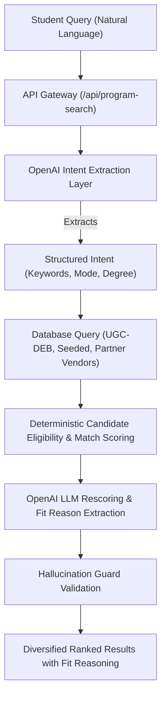
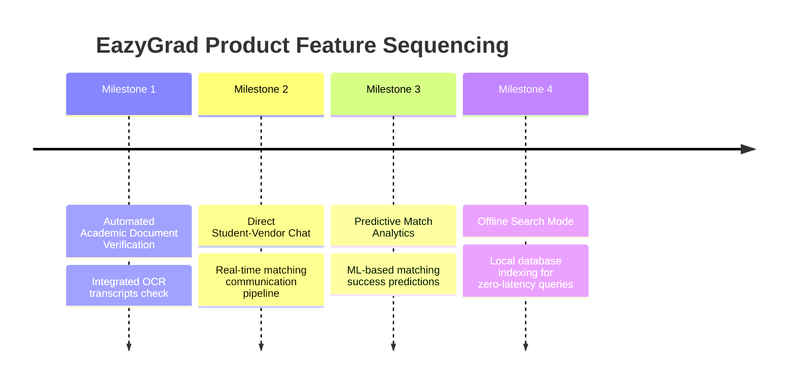

# EazyGrad - AI-Native Course Recommendation Platform

EazyGrad is an AI-powered, transparent course search and recommendation platform that connects natural language student query intents with verified higher-education datasets in India. It balances structured regulatory data (UGC-DEB, AISHE, NIRF) with an intelligent, conversational candidate matching experience.

---

## 1. Business Case & Product Vision

### The Problem
The higher education search landscape in India is heavily fragmented, commercially biased, and opaque. Students seeking online or distance courses face several challenges:
- **Misleading Marketing**: Third-party aggregators often push high-commission courses rather than the best student-fit options.
- **Regulatory Confusion**: Students struggle to verify whether a course is officially recognized and entitled by the **UGC-Distance Education Bureau (UGC-DEB)**.
- **Manual Eligibility Matching**: Checking if a student's educational background (stream, marks, location, study mode) fits a university's criteria is a manual, error-prone task.

### The Solution
EazyGrad provides a transparent, **student-facing AI search engine** that acts as an unbiased matchmaker:
1. **Natural Language Querying**: Students describe their career goals and preferences in plain text (e.g., *"I want to work in public services and prefer an online commerce degree under ₹50k"*).
2. **AI Matching with Reasoning**: The AI matches their goal against verified DB records, calculates a percentage match, and details exactly **why** the course is a fit, along with critical **watch-outs** (like high fees or relocation constraints).
3. **Regulatory Safety (Hallucination Guard)**: The AI search results are strictly locked to validated database rows. The AI can *never* hallucinate a university or make up a non-existent degree path.
4. **Partner-Candidate Pipeline**: Education providers (vendors) can add, edit, and delete their own courses via a premium dashboard, matching them instantly with active candidate profiles.

---

## 2. System Architecture & Matching Pipeline

The system is built on a decoupled, Next.js proxy and Django REST Framework backend.



### Stage-by-Stage Matching Mechanics

1. **Query Processing**: The Next.js client forwards the search term to the Django API, optionally appending the candidate's verified profile snapshot.
2. **Intent Parsing (NLP)**: The backend utilizes `gpt-4o-mini` to extract structured parameters (keywords, degree level, mode) from the natural language query.
3. **Fallback Logic**: If the OpenAI service is down or unconfigured, the system automatically uses a **deterministic regex parser** to extract keywords, preventing search outages.
4. **Multi-Source Querying**: The system searches three database sources:
   - **`DemoProgramme`**: Seeded mock programs (20 items).
   - **`UGCDEBProgramme`**: Entitled online and distance programs (291 items).
   - **`VendorCourse`**: Direct partner-submitted listings.
5. **Eligibility Scoring**: Evaluates candidate streams, subjects, and study preferences.
6. **Semantic Fit Rescoring**: Highlights compatibility between the student's career description and the program's syllabus, generating semantic reasoning tags.
7. **Strict Hallucination Guard**: The LLM is prohibited from creating records. It is only given database-retrieved course IDs to evaluate. Any output referencing course IDs not present in the database query is filtered out, ensuring absolute data integrity.

---

## 3. Technology Stack

- **Frontend**: Next.js 16 (App Router), TypeScript, Tailwind CSS, Framer Motion (animations), FontAwesome 6, and Google Font **Outfit**.
- **Backend**: Django 5.x, Django REST Framework, SQLite/PostgreSQL, Pipenv, and OpenAI API.

---

## 4. Installation & Local Setup Guide

### Prerequisites
Ensure you have the following installed on your machine:
- Node.js (v18+) & `npm` / `yarn`
- Python (v3.10+) & `pip` / `pipenv`

---

### Backend Setup (Django)

1. **Navigate to the Backend directory**:
   ```bash
   cd backend
   ```
2. **Install dependencies**:
   Using `pipenv` (recommended):
   ```bash
   pipenv install
   ```
   *Alternatively, using standard pip*:
   ```bash
   pip install -r requirements.txt
   ```
3. **Configure Environment Variables**:
   Create a `.env` file in the `backend/` root directory:
   ```bash
   cp .env.example .env
   ```
   Add your OpenAI API credentials and configurations in `.env`:
   ```env
   OPENAI_API_KEY=your-actual-api-key
   OPENAI_API_URL=https://api.openai.com/v1/chat/completions
   OPENAI_MODEL=gpt-4o-mini
   ```
4. **Run Database Migrations**:
   ```bash
   pipenv run python manage.py migrate
   ```
5. **Seed the Database (Demo Programmes)**:
   Populate the 20 seeded demo courses (such as *BA Public Administration* or *B.Com*):
   ```bash
   pipenv run python manage.py seed_demo_programmes
   ```
6. **Start the Development Server**:
   ```bash
   pipenv run python manage.py runserver
   ```
   The backend API will now be live on `http://127.0.0.1:8000`.

---

### Frontend Setup (Next.js)

1. **Navigate to the Frontend directory**:
   ```bash
   cd ../frontend
   ```
2. **Install dependencies**:
   ```bash
   yarn install
   # or
   npm install
   ```
3. **Configure Environment Variables**:
   Create a `.env.local` file in the `frontend/` directory:
   ```bash
   cp .env.local.example .env.local
   ```
   Verify the backend URL variable matches:
   ```env
   BACKEND_RECOMMENDATIONS_ANALYSIS_URL=http://127.0.0.1:8000/api/recommendations/analysis/
   ```
4. **Start the Next.js Development Server**:
   ```bash
   yarn dev
   # or
   npm run dev
   ```
   Open your browser and navigate to `http://localhost:3000`.

---

## 5. "What Next" Product Roadmap



1. **Automated Academic Document Verification**: Implement AI OCR scanning of candidate marksheets and certificates to instantly verify passed status, graduation streams, and marks, preventing candidate fraud and automating eligibility checks.
2. **Direct Student-Vendor Chat**: Real-time messaging between matched students and institution admission managers to fast-track student enrollment.
3. **Predictive Match Analytics**: Train an ML model on historical student enrollments and drop-out rates to provide candidates with a "Success Probability" score showing their likelihood of graduation.
4. **Offline Search Indexing**: Sync seeded and high-priority UGC courses directly to local device storage using indexedDB to allow zero-latency, offline search and comparison.
